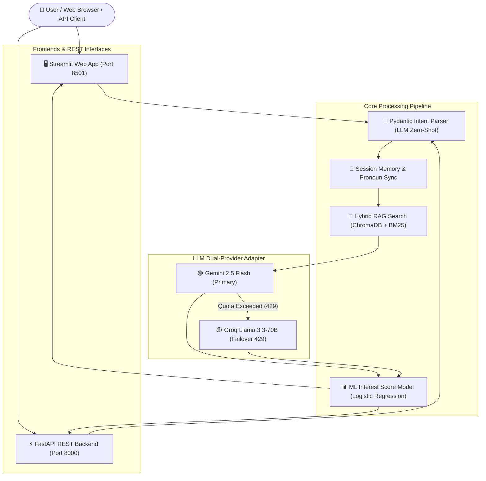

# 🤖 FoodieBot — Intelligent Full-Stack AI Restaurant Concierge

[](https://www.python.org/)
[](https://fastapi.tiangolo.com/)
[](https://streamlit.io/)
[](https://www.trychroma.com/)
[](LICENSE)

**FoodieBot** is a production-ready, full-stack AI restaurant assistant powered by **Hybrid Retrieval-Augmented Generation (Dense Vector + Sparse Lexical RAG)**, **Dual LLM Provider Failover (Gemini 2.5 Flash + Groq Llama 3.3-70B)**, **Zero-Shot Pydantic Intent Reasoning**, and **Machine Learning Purchase Intent Scoring**.

It seamlessly serves both human diners via a responsive **Streamlit Web UI** and external client applications via a **FastAPI REST API**.

---

## 🌟 Key Features & Innovations

### 🧠 1. Dual-Provider LLM Resilience with Automatic Failover
- **Primary Provider**: Google Gemini (`gemini-2.5-flash`) for lightning-fast, high-reasoning conversational responses.
- **Failover Provider**: Groq Llama 3.3 (`llama-3.3-70b-versatile`) automatically triggered on `429 Rate Limit` or quota exhaustion.
- **Zero-Downtime Reliability**: Guarantees uninterrupted customer service even during upstream API degradation.

### 🔎 2. Hybrid RAG Search Engine (Dense + Sparse)
- **Dense Vector Search**: Powered by `ChromaDB` and 384-dimensional `paraphrase-multilingual-MiniLM-L12-v2` embeddings for deep semantic understandability across English and Hinglish/multilingual queries.
- **Sparse Lexical Search**: Powered by `BM25Okapi` to capture exact menu item names, product IDs, and specific ingredients.
- **Reciprocal Score Fusion**: Weighted score combination ($75\%$ Vector + $25\%$ BM25) with dynamic category boost ($+12\%$) and contextual exclusion penalties ($-35\%$).

### 🎯 3. Zero-Hardcoding Pydantic Intent Architecture
- **100% LLM-Driven Parsing**: Employs `parse_intent_with_llm` to map raw user text into structured `ParsedUserIntent` Pydantic schemas.
- **No Brittle Keyword Lists**: Dynamically handles typos (*"zero suger"* $\rightarrow$ *"zero sugar"*), informal slang, multi-lingual queries (*"thoda spicy chicken option"*), and ambiguous pronoun references without hardcoded string arrays.
- **Dynamic Option Exclusion**: Identifies follow-up requests for alternative dishes (`is_request_for_new_options: bool`) and automatically suppresses previously displayed items to ensure fresh recommendations.

### 🔄 4. Real-Time Response Item Synchronization
- **Zero-Hallucination Pronoun Resolution**: `sync_shown_items_from_response` scans LLM text responses in real-time and anchors mentioned items directly to `last_recommended_item`.
- **Seamless Context Anchoring**: Commands like *"add it"*, *"order the 1st option"*, or *"just order my current item"* instantly resolve to the correct menu product.

### 📊 5. Machine Learning Purchase Interest Scoring
- **Dynamic Trajectory Modeling**: Uses Logistic Regression and session features to score customer purchase intent ($50 \rightarrow 100$) in real-time.
- **Live Visual Analytics**: Tracks user interest curves, intent progression, and request latencies live on the Streamlit Analytics dashboard.

---

## 🏗️ Architecture Overview



---

## 📂 Project Structure

```text
FoodieBot/
├── run_app.py             # Master Launcher (Starts FastAPI & Streamlit concurrently)
├── api.py                 # FastAPI REST Backend & Swagger Endpoint (/docs)
├── app.py                 # Main Streamlit UI Entry Point & CSS Theme Engine
├── bot_logic.py           # Dual LLM Provider Adapter & Pydantic Intent Engine
├── database.py            # Hybrid RAG Engine (ChromaDB Vector DB + BM25 Lexical)
├── session_memory.py      # Session Memory Manager & Response Item Sync
├── interest_model.py       # ML Interest Scoring Model (Logistic Regression)
├── ui_components.py       # UI Renderers, Analytics Dashboard & Admin Data Editor
├── log.py                 # Color-Coded Terminal Diagnostic Logger
├── fast_food_products.csv # Production Restaurant Menu Dataset
├── requirements.txt       # Project Python Dependencies
└── .env                   # Environment Credentials & Secrets (Local Only)
```

---

## 🚀 Quick Start & Installation

### Prerequisites
- **Python 3.10+**
- **Git**

### 1. Clone the Repository
```bash
git clone https://github.com/harshitttiwari/FoodieBot.git
cd FoodieBot
```

### 2. Create Virtual Environment & Install Dependencies
```bash
# Create virtual environment
python -m venv venv

# Activate virtual environment
# On Windows:
.\venv\Scripts\activate
# On Linux/macOS:
source venv/bin/activate

# Install required dependencies
pip install -r requirements.txt
```

### 3. Configure Environment Variables
Create a `.env` file in the root directory:
```env
GEMINI_API_KEY=your_gemini_api_key_here
GROQ_API_KEY=your_groq_api_key_here
```
*(Note: FoodieBot will run with Gemini as primary and failover to Groq if rate limits occur.)*

---

## 🖥️ Running FoodieBot

### Option A: Run Full-Stack (FastAPI + Streamlit together) — **Recommended**
Execute the master launcher script to run both backend REST services and frontend UI in one unified terminal:

```bash
python run_app.py
```

- **Streamlit Web UI**: [http://localhost:8501](http://localhost:8501)
- **FastAPI REST API**: [http://127.0.0.1:8000](http://127.0.0.1:8000)
- **Interactive Swagger API Docs**: [http://127.0.0.1:8000/docs](http://127.0.0.1:8000/docs)

---

### Option B: Run Services Separately

#### Run Streamlit Web App Only:
```bash
streamlit run app.py
```

#### Run FastAPI REST Backend Only:
```bash
uvicorn api:app --reload --port 8000
```

---

## 🌐 REST API Endpoints Reference

FoodieBot provides a clean, fully typed REST API with automatic interactive OpenAPI/Swagger documentation at `http://localhost:8000/docs`.

| Endpoint | Method | Description |
| :--- | :--- | :--- |
| `/health` | `GET` | System health check, service readiness, and dataset stats. |
| `/api/chat` | `POST` | Process chat messages, run RAG search, update cart & interest score. |
| `/api/menu` | `GET` | Query full or category-filtered restaurant menu items. |

### Example REST Payload (`POST /api/chat`)
```json
{
  "message": "hnji tell something thoda spicy chicken option",
  "chat_history": []
}
```

### Example REST Response
```json
{
  "response": "Here's a delicious spicy option for you:\n\n• Southern Biscuit Chicken Sandwich – $10.59\n     Calories: 820\n     Category: Fried Chicken\n     Allergens: Contains: gluten;dairy",
  "interest_score": 59,
  "action": "VIEW_MENU",
  "cart": [],
  "duration_ms": 342
}
```

---

## 💻 Terminal Logging & Diagnostics (`log.py`)

FoodieBot features real-time, color-coded terminal diagnostics so developers can inspect inner system state during live chats:

```text
======================================================================
  STARTING FOODIEBOT FULL-STACK SYSTEM (FASTAPI + STREAMLIT)
======================================================================
[INFO] LLM Provider Active: Gemini Flash (gemini-2.5-flash)
[EMBED] Generated 384-dim vector embedding for: 'something light and healthy'
[VECTOR] Retrieved 10 items | Top Relevance: 87.42%
[INTENT] Action: VIEW_MENU | Query: 'healthy options'
[SCORE] Interest Score Updated: 50 -> 61 (+11)
```

If Gemini encounters a rate limit (`429`), the logger immediately flags the failover event:
```text
[WARN] Gemini Flash Quota Exceeded (429) -> Failing over to Groq Llama 3.3 (llama-3.3-70b-versatile)
```

---

## 🧪 Example Conversational Capabilities

- **Natural Cravings & Recommendations**:
  > 👤 *"I want something light and healthy"*  
  > 🤖 Suggests `Caprese Balsamic Salad` or `Superfood Berry Spinach Salad` with full calories and allergen info.

- **Dynamic Follow-up & Option Switching**:
  > 👤 *"Any more option??"*  
  > 🤖 Excludes previously shown salads and dynamically returns fresh alternatives like `Zesty Lentil Protein Bowl`.

- **Pronoun Cart Additions**:
  > 👤 *"Add the 1st option"* or *"add it"*  
  > 🤖 Adds the exact item to the cart, calculates totals, and suggests a complementary beverage/side pairing.

- **Checkout Intent Resolution**:
  > 👤 *"No just order my current item"*  
  > 🤖 Confirms checkout for the items in the cart without getting confused by negative prefixes.

---

## 🤝 Contributing

Contributions are welcome! Please follow these steps:
1. Fork the repository
2. Create your feature branch (`git checkout -b feature/AmazingFeature`)
3. Commit your changes (`git commit -m 'Add some AmazingFeature'`)
4. Push to the branch (`git push origin feature/AmazingFeature`)
5. Open a Pull Request

---

## 📄 License

Distributed under the **MIT License**. See [`LICENSE`](LICENSE) for more information.

---

## 🔗 Links & Resources

- **GitHub Repository**: [harshitttiwari/FoodieBot](https://github.com/harshitttiwari/FoodieBot)
- **FastAPI Documentation**: [FastAPI Docs](https://fastapi.tiangolo.com/)
- **Streamlit Documentation**: [Streamlit Docs](https://docs.streamlit.io/)
- **Chroma Vector Database**: [ChromaDB Docs](https://docs.trychroma.com/)
