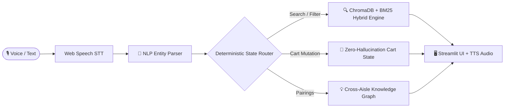

# 🛒 Cartpilot-AI
### *Multilingual Agentic Voice Shopping Assistant with Zero-Hallucination Cart Intelligence*

[](https://cartpilot-ai.streamlit.app/)

[](https://www.python.org/)
[](https://streamlit.io/)
[](https://www.trychroma.com/)
[](https://fastapi.tiangolo.com/)
[](LICENSE)

> 🌐 **Live Web Application:** [https://cartpilot-ai.streamlit.app/](https://cartpilot-ai.streamlit.app/) *(Try with mic enabled in Chrome/Edge)*

---

## ⚡ What is Cartpilot-AI?

**Cartpilot-AI** is an agentic voice-first supermarket shopping concierge that allows users to build, modify, search, and checkout groceries using natural voice commands in **English (India/US)** and **Hindi/Hinglish**.

Unlike standard chat bots that hallucinate prices and products, Cartpilot-AI pairs **LLM conversational reasoning** with a **deterministic state machine** and **hybrid vector retrieval (ChromaDB + BM25)** over 1,100 catalog items.

---

## 🎯 Technical Assessment Feature Mapping

| Assessment Requirement | Cartpilot-AI Implementation |
| :--- | :--- |
| **1. Voice Input (STT & Multilingual NLP)** | In-browser Web Speech API supporting **English (India) 🇮🇳**, **Hindi 🇮🇳**, and **English (US) 🇺🇸** with audio TTS readback. |
| **2. Smart Suggestions & Cross-Aisle Graph** | Cross-aisle co-occurrence knowledge graph (`frequently_bought_together`) with 1-click *"add both"* / *"add it"* follow-ups. |
| **3. Deterministic Cart Management** | Mathematical accuracy for quantities, dynamic item removal, and auto-sorting into 5 supermarket aisles. |
| **4. Voice Search & Price Filtering** | Hybrid semantic vector search (384-dim) + BM25 keyword matching with price range (*"under $5"*) and dietary filters. |
| **5. Production UI & Real-Time Feedback** | Streamlit UI with live latency tracking, audio wave pulse, engagement scoring, and persistent logging (`foodiebot.log`). |

---

## 🏗️ Architecture at a Glance



---

## 🚀 Quickstart (Run in 3 Steps)

### 1. Clone & Install
```powershell
git clone https://github.com/harshitttiwari/Cartpilot-AI.git
cd Cartpilot-AI
python -m venv venv
.\venv\Scripts\activate
pip install -r requirements.txt
```

### 2. Set API Keys (`.env`)
```env
GEMINI_API_KEY=your_gemini_key_here
GEMINI_MODEL=gemini-2.5-flash-lite
GROQ_API_KEY=your_groq_key_here
GROQ_MODEL=openai/gpt-oss-120b
```

### 3. Launch App
```powershell
streamlit run app.py
```
> Open **`http://localhost:8501`** in Chrome/Edge for microphone support.

*(Optional REST API: `uvicorn api:app --reload --port 8000` ➡️ Docs at `http://localhost:8000/docs`)*

---

## 🧪 5 Sample Voice Prompts to Try

| Goal | Spoken Command | What Happens |
| :--- | :--- | :--- |
| **Multi-Item Add** | *"Add 2 milk, 1 bread, and eggs to my list"* | Adds 3 items, computes exact subtotal, and triggers cross-aisle suggestions. |
| **Hindi Recipe Intent** | *"Mujhe paneer butter masala ke liye paneer aur tamatar chahiye"* | Normalizes Hindi items and sorts into Dairy & Produce aisles. |
| **Smart Suggestion** | *"Add both"* | Adds the recommended pairing items in 1 step. |
| **Price Filtered Search** | *"Find organic fruits under $6"* | Hybrid search filters by `[organic]` tag and price $\le \$6.00$. |
| **Instant Checkout** | *"Add 1 butter and checkout"* | Adds butter and finalizes order with delivery confirmation. |

---

## 🛠️ Tech Stack

* **Frontend**: Streamlit, Web Speech API (HTML5 Audio), Vanilla CSS Glassmorphism
* **NLP & Orchestration**: LangChain, Pydantic Structured Outputs, Google Gemini + Groq Failover
* **Search & Vectors**: ChromaDB, SentenceTransformers (`all-MiniLM-L6-v2`), BM25Okapi
* **Backend API**: FastAPI, Uvicorn, Python 3.11

---

## 📄 License
MIT License © 2026 Harshit Tiwari
