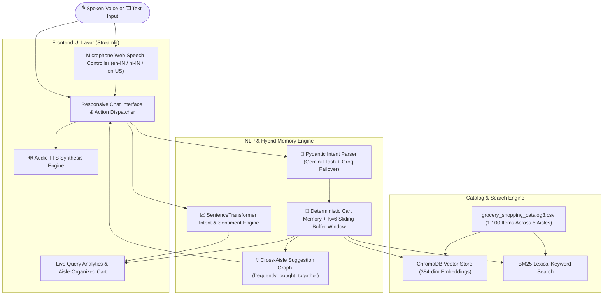

# 🛒 Agentic Voice Command Shopping Assistant
### *Multilingual AI-Powered Supermarket Concierge, Hybrid Search & Dynamic Cart State Manager*

[](https://www.python.org/)
[](https://streamlit.io/)
[](https://fastapi.tiangolo.com/)
[](https://www.trychroma.com/)
[](https://huggingface.co/sentence-transformers/all-MiniLM-L6-v2)
[](https://www.langchain.com/)
[](LICENSE)

---

## 📖 Overview

**Agentic Voice Command Shopping Assistant** is an intelligent, voice-first grocery concierge and shopping list manager built for modern retail and e-commerce. It features real-time in-browser speech recognition, multilingual entity extraction (English India/US, Hindi, and Hinglish), hybrid RAG search across 1,100 catalog products, cross-aisle graph recommendations, and zero-hallucination deterministic cart state management.

---

## 🌟 Key Capabilities & Features

### 🎙️ 1. Real-Time Voice Processing & Synthesis (STT & TTS)
* **Web Speech API Controller**: Real-time browser microphone capturing voice input with listening pulse animations.
* **Multilingual Speech Recognition**: Default configured for **English (India) 🇮🇳 (`en-IN`)**, **Hindi (हिंदी) 🇮🇳 (`hi-IN`)**, and **English (US) 🇺🇸 (`en-US`)**.
* **Text-to-Speech (TTS)**: Reads out order confirmations, subtotals, and smart recommendations.

### 🧠 2. Agentic NLP Parser & Multilingual Understanding
* **Varied & Conversational Phrasing**: Understands natural phrasing (*"We are running low on butter"*, *"I need eggs and bread"*, *"Mujhe 2 packet doodh aur atta chahiye"*).
* **Multi-Item & Quantity Extraction**: Parses multiple commodities, package units, and numerical quantities in a single breath with phonetic number disambiguation (*"add to whole milk"* ➡️ `2x whole milk`).
* **Dynamic Acoustic Error & Slang Handling**: Handles speech mishears dynamically using active cart context.

### 🔍 3. Hybrid RAG Search & Price Range Filtering
* **Dense + Lexical Retrieval**: Combines **384-dimensional dense vectors** (`SentenceTransformers all-MiniLM-L6-v2` in ChromaDB) with **BM25 lexical ranking**.
* **Dietary Tag Boosts**: Supports filters for `[organic]`, `[gluten_free]`, `[keto_friendly]`, `[vegan]`, `[sugar_free]`, and `[low_calorie]`.
* **Price Range Constraints**: Filters search candidates based on voice constraints (e.g. *"Find snacks under $5"*).

### 💡 4. Cross-Aisle Smart Suggestions & Recommendations
* **Knowledge Graph Engine**: Built using `frequently_bought_together` graph relationships from the 1,100 product catalog.
* **One-Phrase Conversational Follow-up**: Supports immediate inclusion via *"add both"*, *"add it"*, or *"add the first one"*.
* **Zero-Hallucination Ordinal Guard**: Validates list bounds so out-of-range commands (e.g., *"add the 3rd one"* when only 1 was shown) do not hallucinate.

### 🧺 5. Deterministic Cart Engine & Aisle Categorization
* **Supermarket Aisle Categorization**: Organizes items across:
  * 🥛 **Dairy & Eggs**
  * 🥦 **Produce**
  * 🍞 **Bakery**
  * 🍚 **Pantry & Staples**
  * 🥤 **Beverages & Snacks**
* **Zero-Hallucination Arithmetic**: All calculations ($\text{Subtotal} = \text{Qty} \times \text{Price}$) are evaluated deterministically in Python.

### 📈 6. Real-Time Engagement & Intent Scoring
* **Dual-Layer Analytics**: Blends SentenceTransformer semantic sentiment with session state milestones.
* **Calibrated Trajectory**: Tracks interest smoothly from neutral (50%) to high purchase intent (95%–100%).

---

## 🏗️ System Architecture



---

## 📋 Assessment Requirements Compliance Matrix

| Requirement from Assessment | Project Implementation | Key Files & Functions |
| :--- | :--- | :--- |
| **1. Voice Input (STT & NLP)** | Web Speech API in-browser recorder, multilingual Indian/US English & Hindi support. | [`voice_component.py`](file:///x:/Voice%20Command/voice_component.py), [`bot_logic.py`](file:///x:/Voice%20Command/bot_logic.py) (`parse_intent_with_llm`) |
| **2. Smart Suggestions** | Cross-aisle co-occurrence graph (`frequently_bought_together`), pronoun resolvers (*"add both"*). | [`data_pipeline.py`](file:///x:/Voice%20Command/data_pipeline.py) (`get_recommendation_graph`), [`session_memory.py`](file:///x:/Voice%20Command/session_memory.py) |
| **3. Shopping List Management** | Multi-item addition, dynamic removal, exact math, aisle categorization. | [`session_memory.py`](file:///x:/Voice%20Command/session_memory.py) (`add_item_to_cart`, `remove_item_from_cart`) |
| **4. Voice-Activated Search** | Brand, size, dietary tags, and price filtering (*"under $5"*). | [`ui_components.py`](file:///x:/Voice%20Command/ui_components.py) (`_hybrid_search`), [`database.py`](file:///x:/Voice%20Command/database.py) |
| **5. Clean UI/UX & Feedback** | Streamlit layout with live metrics, audio feedback, and persistent logging. | [`app.py`](file:///x:/Voice%20Command/app.py), [`ui_components.py`](file:///x:/Voice%20Command/ui_components.py), [`log.py`](file:///x:/Voice%20Command/log.py) |
| **6. REST API & Hosting** | FastAPI backend with Swagger docs, ready for Docker/Cloud deployment. | [`api.py`](file:///x:/Voice%20Command/api.py) |

---

## 🚀 Quickstart Guide

### 1. Prerequisites & Virtual Environment

Ensure you have **Python 3.10+** installed:

```powershell
# Clone the repository
git clone https://github.com/<your-username>/agentic-voice-shopping-assistant.git
cd agentic-voice-shopping-assistant

# Create and activate virtual environment
python -m venv venv
.\venv\Scripts\activate

# Install dependencies
pip install -r requirements.txt
```

### 2. Environment Configuration

Create a `.env` file in the project root:

```env
# Gemini API Key (Primary)
GEMINI_API_KEY=your_gemini_api_key_here
GEMINI_MODEL=gemini-2.5-flash-lite

# Groq API Key (High-Speed Fallback)
GROQ_API_KEY=your_groq_api_key_here
GROQ_MODEL=openai/gpt-oss-120b
```

### 3. Running the Application

#### 🖥️ Streamlit Web Application:
```powershell
streamlit run app.py
```
> Open **`http://localhost:8501`** in Google Chrome or Microsoft Edge for Web Speech API microphone support.

#### 🔌 FastAPI REST API Backend:
```powershell
uvicorn api:app --reload --port 8000
```
> Interactive Swagger API Documentation: **`http://localhost:8000/docs`**

---

## 🗣️ Comprehensive Test Suite (10 Real-World Scenarios)

| # | Test Scenario | Voice / Text Input | Expected System Behavior |
| :-: | :--- | :--- | :--- |
| **1** | **Multi-Item Breakfast Add** | *"Add 2 croissants, 1 coffee, and 2 orange juice"* | Extracts 3 items, applies quantities, categorizes into Bakery & Beverages, triggers pairing suggestions. |
| **2** | **Smart Suggestion Inclusion** | *"Add both"* | Deterministically adds both suggested companion items into the live cart. |
| **3** | **Hindi Cooking Recipe** | *"Mujhe paneer butter masala ke liye 2 packet paneer aur butter chahiye"* | Translates Hindi commodity names, adds 2x Paneer and 1x Butter to Dairy & Eggs. |
| **4** | **Dietary & Niche Discovery** | *"Show me gluten-free snacks and low-calorie drinks"* | Hybrid search filters across 1,100 items by dietary tags and returns structured options. |
| **5** | **Zero-Hallucination Guard** | *"Add the fifth one"* (when only 2 shown) | Validates recommendation list bounds and refuses to hallucinate unshown items. |
| **6** | **Positional Selection** | *"Add the second one"* | Accurately adds Item #2 from the previous recommendation list. |
| **7** | **Price-Filtered Search** | *"Find organic fruits under $6"* | Retrieves only items tagged organic with price $\le \$6.00$. |
| **8** | **Dynamic Removal** | *"Remove coffee from my list"* | Identifies and removes Coffee, recalculates subtotal, and adjusts engagement score downward. |
| **9** | **Hindi Clear Cart** | *"Sab delete kar do, empty cart"* | Wipes the active basket to $0.00 and drops engagement score to 30%. |
| **10** | **Compound Add & Checkout** | *"Add 2 packets of milk and checkout"* | Adds milk and confirms order delivery in a single response with celebration animation. |

---

## 📁 Repository Structure

```
├── app.py                         # Streamlit application layout & viewport styles
├── voice_component.py             # Microphone Web Speech API controller & TTS engine
├── bot_logic.py                   # LLM intent parser, conversational prompt & fallback engine
├── session_memory.py              # Deterministic cart engine, aisle manager & K=6 buffer memory
├── ui_components.py               # Live shopping cart sidebar, hybrid search & chat UI
├── database.py                    # ChromaDB vector store, BM25 indexing & embedding loader
├── data_pipeline.py               # Preprocessing, synonym dictionary & recommendation graph
├── interest_model.py              # Dual-layer ML sentiment & engagement score engine
├── log.py                         # Colorized console formatter & foodiebot.log file writer
├── api.py                         # FastAPI REST endpoints & Pydantic models
├── grocery_shopping_catalog3.csv  # 1,100 Supermarket grocery items across 5 aisles
├── requirements.txt               # Production dependencies
└── README.md                      # Project documentation
```

---

## 📄 License
This project is open-source and available under the **MIT License**.
